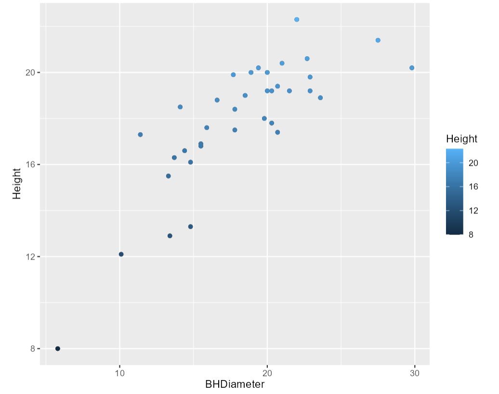
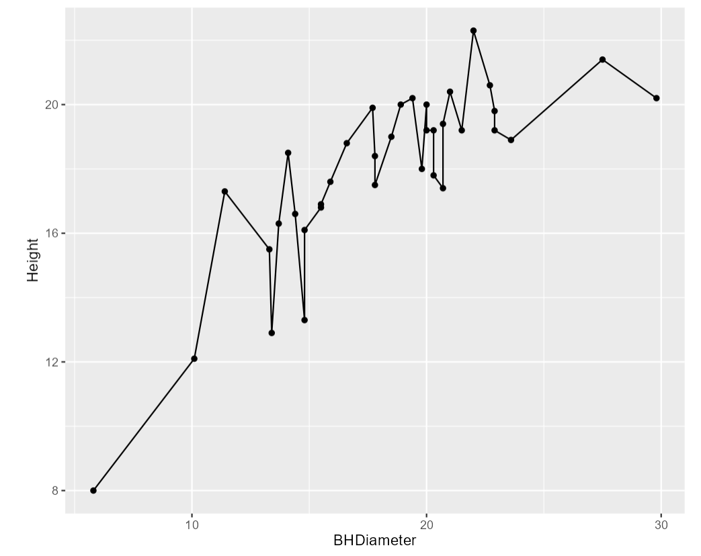
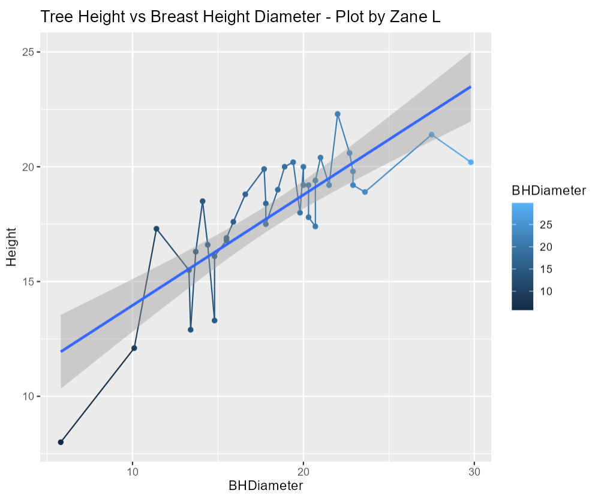

```{r setup, include=FALSE}
knitr::opts_chunk$set(echo = TRUE)
```

# Tasks

## Task 1 
```{r}
setwd("C:/Users/Zanel/OneDrive/Desktop/FALL 2024 STATS/FALL224753lesl0009/Lab/Lab 3")
```

## Task 2 
```{r}
spruce = read.csv("SPRUCE.csv", header=TRUE)
head(spruce, 6)
```

### Tree Height vs BHDiameter
```{r}
plot(Height~BHDiameter, main="Tree Height vs BHDiameter",
     xlab = "Breast Height Diameter (cm)", ylab = "Height of Tree (m)",
     pch = 21, bg = "blue", cex = 1.2,
     xlim = c(0, max(BHDiameter) * 1.1), ylim = c(0, max(Height) * 1.1),
     data = spruce)
```
### Straight Line Relationship?
The data starts at a straight-ish trend, but tails off at the end.

### Trendscatter Plot
```{r}
library(s20x)

lo = layout(matrix(1:3, nrow = 1, ncol = 3, byrow = TRUE))
tsone = trendscatter(Height~BHDiameter, f = 0.5, data=spruce)
tstwo = trendscatter(Height~BHDiameter, f = 0.6, data=spruce)
tsthree = trendscatter(Height~BHDiameter, f = 0.7, data=spruce)
```

### Assume Straight line

```{r}
spruce.lm = with(spruce, lm(Height~BHDiameter))
lo = layout(1)

with(spruce,
plot(Height~BHDiameter, main="Tree Height vs BHDiameter",
     xlab = "Breast Height Diameter (cm)", ylab = "Height of Tree (m)",
     pch = 21, bg = "blue", cex = 1.2,
     xlim = c(0, max(BHDiameter) * 1.1), ylim = c(0, max(Height) * 1.1),
     data = spruce))

abline(spruce.lm)
```
### Straight or Curve
The curve fits better and will fit more of the data.

# Task 4
```{r}
lo = layout(matrix(1:4, nr = 2, nc = 2, byrow = TRUE))

with(spruce,
plot(Height~BHDiameter, main="Tree Height vs BHDiameter",
     xlab = "Breast Height Diameter (cm)", ylab = "Height of Tree (m)",
     pch = 21, bg = "blue", cex = 1.2,
     xlim = c(0, max(BHDiameter) * 1.1), ylim = c(0, max(Height) * 1.1),
     data = spruce))

abline(spruce.lm)


yhat = with(spruce, predict(spruce.lm, data.frame(BHDiameter)))
yhat = fitted(spruce.lm)

with(spruce,
     plot(Height~BHDiameter, main="RSS",
          xlab = "Breast Height Diameter (cm)", ylab = "Height of Tree (m)",
          bg = "blue", pch=21, cex=1.0,
          ylim = c(0, 1.1 * max(Height)), xlim=c(0, 1.1* max(BHDiameter)))
     )

with(spruce, {segments(BHDiameter, Height, BHDiameter, yhat)})
abline(spruce.lm)

with(spruce,
plot(Height~BHDiameter, main="MSS",
     xlab = "Breast Height Diameter (cm)", ylab = "Height of Tree (m)",
     pch = 21, bg = "blue", cex = 1.2,
     xlim = c(0, max(BHDiameter) * 1.1), ylim = c(0, max(Height) * 1.1),
     data = spruce))

with(spruce, abline(h = mean(Height)))

with(spruce, segments(BHDiameter, mean(Height), BHDiameter, yhat, col="Red"))
abline(spruce.lm)

with(spruce,
plot(Height~BHDiameter, main="Zane - Plot",
     xlab = "Breast Height Diameter (cm)", ylab = "Height of Tree (m)",
     pch = 21, bg = "blue", cex = 1.2,
     xlim = c(0, max(BHDiameter) * 1.1), ylim = c(0, max(Height) * 1.1),
     data = spruce))

with(spruce, abline(h = mean(Height)))
with(spruce, segments(BHDiameter, Height, BHDiameter, mean(Height), col = "Green"))
```

# Task 5

### RSS
```{r}
RSS = with(spruce, sum((Height - yhat))^2)
RSS
```
### MSS
```{r}
MSS = with(spruce, sum((yhat - mean(Height))^2))
MSS
```
### TSS
```{r}
TSS = with(spruce, sum((Height - mean(Height))^2))
TSS
```

### MSS / TSS
```{r}
MSS / TSS
```
This is R^2, it gives us a way to reason if a straight line fits our data.

### TSS = RSS + MSS?
```{r}
RSS + MSS 
```
Yes

# Task 5
```{r}
summary(spruce.lm)
```
slope = 0.4814743
intercept = 9.1468390
$$\hat{Height} = \hat{beta}_{0} + \hat{beta}_{1}x$$
$$\hat{Height} = 9.1468 + 0.4815x$$
### Predict 
```{r}
predict(spruce.lm, data.frame=(BHDiameter = c(15, 18, 20)))
```

# Task 6
```{r}
library(ggplot2)

g = ggplot(spruce, aes(x = BHDiameter, y = Height, color=BHDiameter))
g = g + geom_point() + geom_line() + geom_smooth(method = "lm")
g = g + ggtitle("Tree Height vs Breast Height Diameter - Plot by Zane L")
g
```

# Task 7
{ width=80% }
{ width=80% }
{ width=80% }


