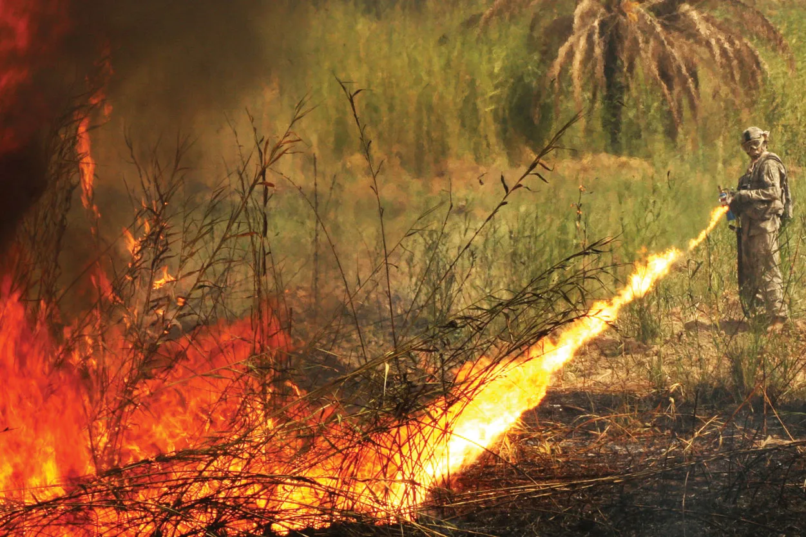
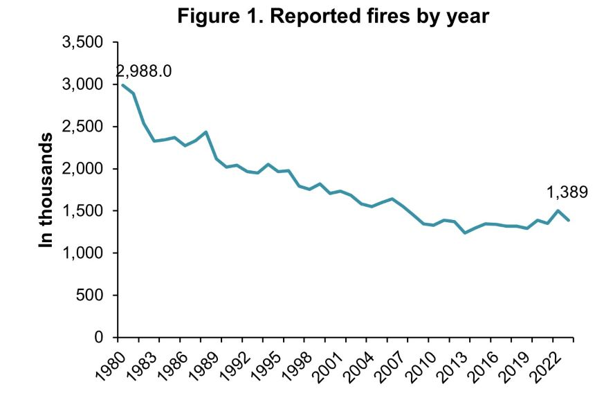
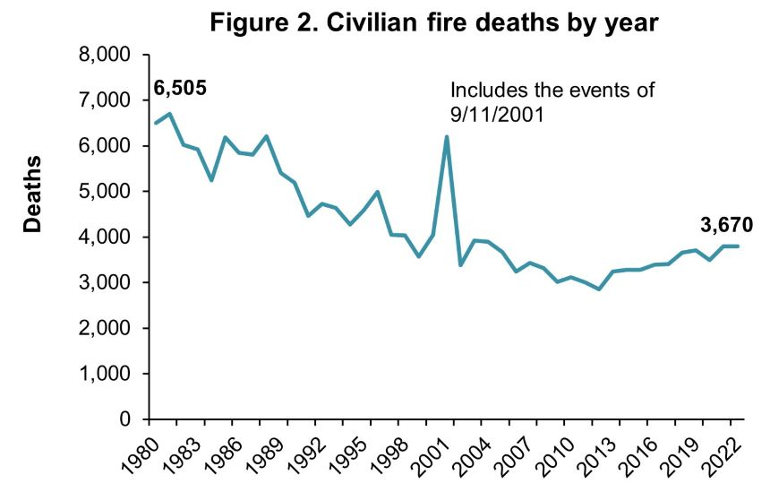

```{r setup, include=FALSE}
knitr::opts_chunk$set(echo = FALSE)
```

## The Beginning

Fire was one of the most important technologies that humanity has ever discovered. With it gave humans the possibility to further develop and grow as a species, leading the the thriving species we are today. Many historians believe that humanities ability to continue to evolve is closely tied with the use of fire. Early hominids who were leaving in eastern Africa about 2.5mya. Researchers have tracked the use of fire (mainly to cook). It may not be the first thing you think about, but using fire to cook along with a group of other people requires many different skills, such as collection, accumulation, cooking, defense, stealing, etc. It is believed that many of these social skills happened around a campfire. This most likely contributed a great deal to the humans we see today, larger brains, modern limb proportions, and various other human and social traits [1].

<center>

. CNRS éditions."){ width=50% }

</center> <br />

## Progression

Over time the use for these fires have changed, early in human life we used torches to be able to see at night, eventually we got electricity so that became obsolete, soon we would need fire to heat our steam engines, now we use fire to help wildlife populations regrow with controlled forest fires. Humanity has always made use of fire to be able to advanced ourselves, that much can be accepted as fact.

<center>

 changes in the last two centuries."){ width=50% }

</center> <br />

## The Negatives

However, with all this positive gain comes negative gain as well. Burns gotten from war have been documented dating at least 5000 years ago, and fire has probably been used as a weapon long before that. From lighting arrows on fire, to burning down fields of farmland, to the creation of explosives and gunpowder, fire can also be used for something negative and also tracks throughout human history, just like the positives of fire.


<center>

{ width=50% }

</center> <br />

## The Modern Age

In the modern age, one of our biggest concerns with fires has to be the threat on human life due to a fire breaking out at a property as well as the property damage value. Today, I want to explore more of the fire damage aspect of that concern. Fire damage cost has continued to rise unlike deaths caused by fire. This is most likely caused by the fact that materials used in building are more expensive than the materials used in the past.

<center>

{ width=75% }
{ width=75% }
{ width=75% }

</center> <br />

## The Data

Suppose a fire insurance company wants to relate the amount of fire damage in major residential fires to the distance between the residence and the nearest fire station. The study is to be conducted in a large suburb of a major city; a sample of 15 recent fires in this suburb is selected. The amount of `DAMAGE y` and the `DISTANCE x` between the fire and the nearest fire station are recorded for each fire.

```{r}
fire = read.csv("FIREDAM.csv")
head(fire)
```

Our data set can be described as `DISTANCE` from fire station in miles and `DAMAGE` x 1000 dollars in damage. We also know that `DISTANCE` is a continuous length as we are measuring from one point and extending outward.

## The Problem

Suppose that we are a urban designer tasked with laying out a couple districts of a proposed city. One thing we need to keep in mind is for disasters leading to emergency response. One of these disasters could be a fire at a property. So how do we know how many fire stations we need and how far apart they should be. Of course, their is most likely a lot of already existing regulation on this, but for the sake of this problem lets assume those things don't exist. So how might we go about this?

<br />

One way we can go about this is to use fire damage vs cost of damage. If we can figure out a model that lets us calculate how much damage a residential property will receive depending on how far away the closest fire station is, we can determine an 'acceptable' amount of value per fire and set up the fire stations that way.

## The Question

Using the firedam data set, we want to know if there is any significant statistical relationship between the distance and amount of damage in dollars caused by the fires. If we can prove this, then we can reasonable use this data set to layout our residential blocks.

## Preview of our Statistical Data

```{r}
library (s20x)
pairs20x(fire)

x = fire$DISTANCE
y = fire$DAMAGE
```

```{r}
library(ggplot2)
g = ggplot(fire, aes(x = DISTANCE, y = DAMAGE)) + geom_point()
g = g + geom_smooth(method = "loess")
g
```

These plots reveal to us that our data appears to follow somewhat of a linear trend. Knowing this beforehand is important as it tells us that there is a possibility that our data could be simple linear regression (SLR) which is what we are after. We can know move further with analysis on what information this data can tell us.

## Theory of Simple Linear Regression


The steps we are going to follow for our Simple Linear Regression Model will be the following: \

1. Hypothesize a probabilistic model, we will be using the straight-line model $y = \beta_0 + \beta_1x + \epsilon$.

2. Use the methods of least squares to estimate the unknown the unknown parameters in the deterministic component, $\beta_0 + \beta_1x$ This will give us $\hat{y} = \hat{\beta_0} + \hat{\beta_1x}$ with a sum of squared errors (SSE) that is smaller than the SSE for any other straight-line model.\

3. We will then specify a probability distribution of the random error component $\epsilon$. We will use residual analysis to ensure of assumptions are correct. \

4. Next we will assess the utility of the hypothesized model. This includes making inferences about the slope of $\beta_1$, calculating the coefficient of correlation $r$ and calculating the coefficient of determination $r^2$.\

5. If the previous steps lead us to a model that we are satisfied with it, we can use the model to estimate the mean $y$ value, $E(y)$, for a given $x$ value and to predict an individual $y$ value for a specific value of $x$ [5].\

## The Analysis

We have already done the first step, as we know we are going to use a linear model, and we showed that our data appears to use a linear line of fit.

### Method of Least Squares

```{r}
fire.lm = lm(DAMAGE~DISTANCE, data=fire)
summary(fire.lm)
```

This gives us the least square estimates as:
$$\hat{\beta_0} = 10.2779 \\
\hat{\beta_1} = 4.9193 $$

### Calculate the Confidence Intervals for the Parameter Estimates

```{r}
confint(fire.lm, level = 0.95)
```

Here we can see that our intervals lie within what the confidence interval should be, so we can be fairly confident that our $\hat{\beta_0} = 10.2779 \hat{\beta_1} = 4.9193$ values are good to use.

## Validate Assumptions

### Scatterplot 

```{r}
with(fire,
plot(DAMAGE~DISTANCE, main="Scatter Plot and Fitted Line of Damage vs Distance",
     xlab = "Distance", ylab = "Damage",
     pch = 21, bg = "blue", cex = 1.2,
     xlim = c(0, max(DISTANCE) * 1.1), ylim = c(0, max(DAMAGE) * 1.1),
     data = fire))

abline(fire.lm)
```

Here we can see that the scatter plot combined with our hypothesized model works quite well, you can see the points are fairly evenly distributed along the line. This is a clue to us that our model will work with the data.

### Residual Line Segments

```{r}
yhat = with(fire, predict(fire.lm, data.frame(DISTANCE)))
yhat = fitted(fire.lm)

with(fire,
     plot(DAMAGE~DISTANCE, main="Residual Line Segments of Distance vs Damage",
     xlab = "Distance", ylab = "Damage",
          bg = "blue", pch=21, cex=1.0,
          ylim = c(0, 1.1 * max(DAMAGE)), xlim=c(0, 1.1* max(DISTANCE)))
     )

with(fire, {segments(DISTANCE, DAMAGE, DISTANCE, yhat)})
abline(fire.lm)
```

This plot shows us the residual line segments, what this is showing is how much deviation there is between our points and the model we propose. Again, ideally you want their to be equal points on both sides of the line with the points being pretty close to the line in equal intervals.

### Plot of Means

```{r}
with(fire,
plot(DAMAGE~DISTANCE, main="Mean of Distance vs Damage",
     xlab = "Distance", ylab = "Damage",
     pch = 21, bg = "blue", cex = 1.2,
     xlim = c(0, max(DISTANCE) * 1.1), ylim = c(0, max(DAMAGE) * 1.1),
     data = fire))

with(fire, abline(h = mean(DAMAGE)))


with(fire, segments(DISTANCE, mean(DAMAGE), DISTANCE, yhat, col="Red"))
abline(fire.lm)
```

Here we are showing the difference of the two means of Distance and Damage by plotting them against each other. This gets us the model sum of squares.


### Plot of Means with Total Devation Line Segments

```{r}
with(fire,
plot(DAMAGE~DISTANCE, main="Total Deviation Line Segments of Distance vs Damage",
     xlab = "Distance", ylab = "Damage",
     pch = 21, bg = "blue", cex = 1.2,
     xlim = c(0, max(DISTANCE) * 1.1), ylim = c(0, max(DAMAGE) * 1.1),
     data = fire))

with(fire, abline(h = mean(DAMAGE)))
with(fire, segments(DISTANCE, DAMAGE, DISTANCE, mean(DAMAGE), col = "Green"))
```

This plot shows us $\hat{y} = \bar{y}$ and gives us the total sums of squares.

```{r}
RSS = with(fire, sum((DAMAGE-yhat)^2))
RSS

MSS = with(fire, sum((yhat - mean(DAMAGE))^2))
MSS

TSS = with(fire, sum((DAMAGE-mean(DAMAGE))^2))
TSS

cat(MSS / TSS)
```
Here the value we calculated tells us the value for the mean line, we want this number to be as close to 1 as possible because it means that the trend line is a good fit for the data. Here since our value is `0.9234782` we can safely say that the trend line is very good for our data set.

## Specify the Probability Distribution of the Random Error Component ε.

```{r}
library(s20x)
trendscatter(DAMAGE~DISTANCE, f = 0.5, data = fire, main="DAMAGE vs DISTANCE")
```

```{r}
height.res = residuals(fire.lm)
height.fit = fitted(fire.lm)

plot(fire$DISTANCE, height.res, xlab="DISTANCE", ylab = "Residuals", ylim = c(-1 * max(height.res), 1 * max(height.res)), xlim = c(0, 0.16 * max(height.fit)), main = "Residuals vs DISTANCE")
```

```{r}
trendscatter(height.res~height.fit, f = 0.5, data = fire.lm, xlab="Fitted Values",ylab="Residuals",ylim=c(-2*max(height.res),2*max(height.res)),xlim=c(12,1*max(height.fit)), main="Residuals vs Fitted Values")
```

What we are looking at these two plots is that they are normalized around the 0 axis, meaning we see similar distribution between the two on both sides of the x-axis about 0.

```{r}
normcheck(fire.lm, shapiro.wilk = TRUE)
```

This graph shows us that we do not have enough evidence to reject the null hypothesis, this is due to the p-value being 0.474, meaning that we don't have enough evidence to reject that hypothesis, which usually you can do if the p-value is less than the alpha, which is usually 0.05. This tells us the data is statistically likely to be distributed normally.

```{r}
summary(fire.lm)$coefficients
```

We see here that the P-values for $\beta_1$ < 0.05 which suggests that `DISTANCE` is a statistically significant predictor of `DAMAGE`.

```{r}
correlation = cor(fire$DISTANCE, fire$DAMAGE)
correlation
```

A high positive r close to 1 indicates a strong positive linear relationship. Here, we can see we are at ~0.96.

## Use of Model for Estimation and Prediction

```{r}
distance_seq = data.frame(DISTANCE = seq(min(fire$DISTANCE), max(fire$DISTANCE), length.out = 100))
predictions = predict(fire.lm, newdata = distance_seq, interval = "prediction")
plot(fire$DISTANCE, fire$DAMAGE, main = "DAMAGE vs DISTANCE with Prediction Intervals",
     xlab = "Distance", ylab = "Damage", pch = 21, bg = "blue")
matlines(distance_seq$DISTANCE, predictions, lty = c(1,2,2), col = c("red", "green", "green"))
```

Here we create our final plot, showing the predictions ranges we can make with a confidence interval of 0.95. It is important to note that we should not make any predictions from outside the defined ranges we already have, so this would not be statistically sound for ranges above ~6 and below ~1.

## Conclusions

### Research Question and Results

So with all of this, what are we able to say about the data. Well the whole point for doing what we were doing was to see if it was statistically viable to be able to build our hypothetical residential area using the data provided. With the steps we have shown above we have shown that as possible. We can now take any point within that distance of (~1, ~6) and get an accurate reading, for example:

```{r}
new_distance = data.frame(DISTANCE = 3.5)
predict(fire.lm, newdata = new_distance, interval = "prediction")
```
So with this we can see for a distance of 3.5 miles, we can expected there to be somewhere between \$22,324 and \$32,667. In a perfect world however, we expected the value to be $27,496 worth of damage.

### Suggestions Going Forward

I recommend adding more major residential fires and more distance from each fire station. With more data we would be able to ideally plan out more of the city and get a more accurate reading on the distances and damages. It would also be ideal to get data for industrial and commercial areas so the same can be applied, however I would recommend keeping those separate as the overlap between them due to different uses would hurt the data.

## References

[1] Juli G. Pausas, Jon E. Keeley, A Burning Story: The Role of Fire in the History of Life, BioScience, Volume 59, Issue 7, July 2009, Pages 593–601, https://doi.org/10.1525/bio.2009.59.7.10

[2] B. S. Atiyeh, S. W. A. Gunn, and S. N. Hayek, "Military and Civilian Burn Injuries During Armed Conflicts," Annals of Burns and Fire Disasters, vol. 20, no. 4, pp. 203–215, Dec. 2007. [Online]. Available: https://pmc.ncbi.nlm.nih.gov/articles/PMC3188083/. [Accessed: Dec. 3, 2024].

[3] The Editors of Encyclopaedia Britannica, "Flame thrower," Encyclopaedia Britannica, Nov. 7, 2024. [Online]. Available: https://www.britannica.com/technology/flame-thrower. [Accessed: Dec. 3, 2024].

[4] National Fire Protection Association, "Fire Loss in the United States," 2023. [Online]. Available: https://www.nfpa.org/education-and-research/research/nfpa-research/fire-statistical-reports/fire-loss-in-the-united-states. [Accessed: Dec. 3, 2024].

[5] W. M. Mendenhall and T. L. Sincich, Statistics for Engineering and the Sciences, 6th ed. New York: Chapman and Hall/CRC, 2016, p. 546.
